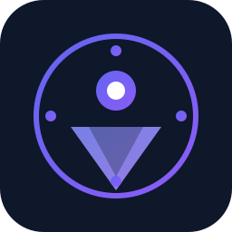

# 本地化AI智能浏览器

<div align="center">



**基于 Chromium 内核的本地 AI 智能浏览器** —— 无需账号、数据完全本地、集成大模型对话

[](LICENSE)
[](/)
[](https://www.electronjs.org/)
[](https://react.dev/)
[](https://vitejs.dev/)

</div>

---

## ✨ 功能特性

### 🌐 浏览器核心
- 基于 **Chromium 128+** 内核（Electron 35 内置）
- 标签页管理、前进/后退/刷新
- 书签管理（增删改查）
- 浏览历史记录（本地 SQLite）
- 地址栏导航 + 页面内搜索

### 🤖 AI 对话助手
- 点击工具栏 **AI** 按钮，滑出侧边栏即可对话
- 支持 **4 家预设大模型**：

| 提供商 | 模型 | API 格式 |
|--------|------|----------|
| 🇨🇳 智谱 GLM-4 | glm-4-flash / glm-4-plus | OpenAI 兼容 |
| 🐱 阿里 Qwen | qwen-turbo / qwen-plus | OpenAI 兼容 |
| 🔶 腾讯 混元 | hunyuan-turbo / hunyuan-pro | OpenAI 兼容 |
| 🐬 DeepSeek | deepseek-chat / deepseek-coder | OpenAI 兼容 |

- 支持**自定义 API**，兼容任意 OpenAI / Anthropic 格式的模型服务
- 流式输出（SSE）、多轮对话、对话历史本地保存

### 🔒 隐私优先
- **无需任何互联网账户**
- 所有数据（书签、历史、AI 配置、AI 对话历史）全部存储在用户本地
- AI 配置使用 `electron-store` 加密存储
- 数据不外传、不上报

### 🎨 UI 设计
- 深色主题，现代化界面
- 响应式侧边栏 AI 助手
- 抽象 AI Logo（圆形 ◉ + 三角形 ▽ 渐变蓝紫色）

---

## 📁 项目结构

```
local-ai-browser/
├── package.json            # 项目配置 + npm 脚本 + electron-builder 配置
├── SPEC.md                 # 产品规格文档
├── README.md               # 项目说明文档（本文件）
├── DIRECTORY.md            # 目录结构说明
│
├── src/                    # 源代码
│   ├── main/               # Electron 主进程
│   │   ├── index.ts        # 应用入口，创建 BrowserWindow，注册 IPC
│   │   ├── ipc/            # IPC 处理器
│   │   │   ├── index.ts    # IPC 入口，统一注册所有 handler
│   │   │   ├── bookmarks.ts  # 书签增删改查
│   │   │   ├── history.ts    # 历史记录增删改查
│   │   │   ├── ai.ts        # AI 配置读写 + 对话历史管理
│   │   │   └── ai/
│   │   │       └── chat.ts   # AI 厂商 API 调用（流式 SSE）
│   │   ├── store/          # 数据持久化
│   │   │   ├── config.ts   # electron-store 加密存储（AI 配置等）
│   │   │   └── db.ts       # SQLite 数据库（书签、历史、AI 对话）
│   │   └── utils/
│   │       └── logger.ts   # 日志工具
│   │
│   ├── preload/            # 预加载脚本
│   │   └── index.ts        # contextBridge 暴露 electronAPI 给渲染进程
│   │
│   └── renderer/           # React 前端（渲染进程）
│       ├── main.tsx        # React 入口
│       ├── App.tsx         # 根组件
│       ├── types.ts        # TypeScript 类型定义
│       ├── styles/
│       │   └── globals.css # Tailwind 基础样式 + 滚动条定制
│       ├── components/
│       │   ├── common/
│       │   │   └── TitleBar.tsx      # 无边框窗口标题栏（最小化/最大化/关闭）
│       │   ├── Browser/
│       │   │   ├── Toolbar.tsx       # 工具栏（导航按钮 + 地址栏 + AI 按钮）
│       │   │   ├── TabBar.tsx        # 标签栏（多标签支持）
│       │   │   └── WebViewContainer.tsx # webview 加载容器
│       │   └── AI/
│       │       ├── AILogo.tsx        # 抽象 AI Logo（SVG）
│       │       ├── AISidebar.tsx     # AI 侧边栏容器
│       │       ├── AIModelConfig.tsx # 模型配置面板
│       │       └── AIChatView.tsx    # AI 对话界面
│       └── hooks/
│           └── useWindowState.tsx    # 窗口状态 React Context
│
├── resources/              # 构建资源
│   └── icon.ico            # Windows 应用图标（.ico）
│
├── dist/                   # Vite 构建输出（前端）
├── dist-electron/          # Electron 主进程 + preload 构建输出
├── release/                # electron-builder 输出目录（exe 安装包）
│
├── index.html              # Vite 入口 HTML
├── vite.config.ts          # Vite + electron-plugin 配置
├── tailwind.config.js      # Tailwind CSS 配置
├── postcss.config.js       # PostCSS 配置
├── tsconfig.json           # TypeScript 配置（渲染进程）
├── tsconfig.node.json      # TypeScript 配置（Node 环境）
└── .gitignore              # Git 忽略文件
```

---

## 🚀 快速开始

### 开发模式

```bash
# 安装依赖
npm install

# 启动开发服务器
npm run dev
```

### 构建生产版本

```bash
# 构建 Vite + Electron
npm run build:vite

# 打包 Windows 安装程序
npm run dist
```

输出文件位于 `release/` 目录。

### 环境要求

- **Node.js** >= 22.0.0
- **Windows** x64（用于打包 Windows exe）

---

## 🏗️ 技术栈

| 层级 | 技术 | 版本 |
|------|------|------|
| 桌面框架 | Electron | 35.0.0 |
| 前端框架 | React | 18.3.1 |
| 构建工具 | Vite | 6.0.0 |
| 浏览器内核 | Chromium | 128+ |
| 样式 | Tailwind CSS | 3.4.17 |
| 数据存储 | better-sqlite3 | 11.7.0 |
| 配置存储 | electron-store | 8.2.0 |
| 打包工具 | electron-builder | 25.1.8 |

---

## 📝 许可证

本项目基于 [MIT License](LICENSE) 开源。

---

## 🙏 致谢

- [Electron](https://www.electronjs.org/) - 跨平台桌面应用框架
- [React](https://react.dev/) - UI 框架
- [Vite](https://vitejs.dev/) - 下一代前端构建工具
- [Tailwind CSS](https://tailwindcss.com/) - 实用优先 CSS 框架