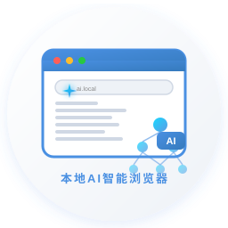

# 🌐 本地AI智能浏览器

<p align="center">
  
</p>

<p align="center">
  <strong>基于 Electron + Chromium 的本地化 AI 增强浏览器</strong>
</p>

<p align="center">
  
  
  
</p>

---

## ✨ 功能特性

### 🔒 离线优先 · 数据本地存储
- 收藏夹、浏览历史、AI 模型配置均存储在本地
- 无需注册互联网账户，开箱即用
- 数据完全受你控制，不上传云端

### 🤖 AI 控制浏览器
通过自然语言指令控制浏览器所有操作：

| 示例指令 | 功能说明 |
|---------|---------|
| `打开这个页面的所有链接` | 批量提取并在新标签页打开当前页面所有链接 |
| `总结这个页面` | AI 总结当前页面核心内容 |
| `收藏这个页面` | 一键添加到本地收藏夹 |
| `打开收藏夹` | 在侧边栏展示收藏内容 |
| `查看浏览历史` | 查看历史浏览记录 |
| `打开某个栏目的所有链接` | 提取栏目内链接并批量打开 |

### 🔌 MCP 协议 · 主流模型支持
遵循 MCP（Model Context Protocol）开放协议，支持三大主流大模型：

| 模型 | API 端点 | 特点 |
|------|---------|------|
| **MiniMax** | `https://api.minimax.chat/v1` | 高速响应 |
| **DeepSeek** | `https://api.deepseek.com/v1` | 高性价比 |
| **Qwen（通义千问）** | `https://dashscope.aliyuncs.com/v1` | 阿里云生态 |

> 可在设置中自由添加、切换、删除模型

### 🖥️ 简洁易用的界面
- 浅色主题，视觉舒适
- 三栏布局：侧边栏（收藏/历史）+ 主内容区（浏览器）+ AI 面板
- 侧边 AI 按钮，一键呼出 AI 对话

---

## 📸 界面预览

```
┌─────────────────────────────────────────────────────────┐
│  🧠 本地AI智能浏览器                    [AI] 按钮        │
├───────────┬─────────────────────────┬────────────────────┤
│           │                         │                    │
│  ⭐ 收藏   │     Chromium 内核        │   💬 AI 对话面板    │
│  🕐 历史   │     WebView 渲染区域      │                    │
│           │                         │   输入自然语言指令   │
│           │                         │   控制浏览器操作     │
│           │                         │                    │
└───────────┴─────────────────────────┴────────────────────┘
```

---

## 🛠️ 技术栈

| 技术 | 说明 |
|------|------|
| **Electron 28** | 桌面应用框架，集成 Chromium 内核 |
| **Vue 3** | 渐进式前端框架 |
| **Vite** | 快速构建工具 |
| **MCP 协议** | 模型上下文协议，AI 工具调用标准 |
| **electron-store** | 本地 JSON 数据持久化存储 |

---

## 🚀 快速开始

### 环境要求
- Node.js ≥ 18
- pnpm ≥ 8

### 安装依赖

```bash
pnpm install
```

### 开发模式

```bash
pnpm run dev
```

### 构建 Windows 安装包

```bash
# 设置 Electron 国内镜像（可选，加速下载）
export ELECTRON_MIRROR=https://npmmirror.com/mirrors/electron/

pnpm run dist
```

构建产物位于 `release/win-unpacked/LocalAIBrowser.exe`（便携版，无需安装）。

---

## 📁 项目结构

```
local-ai-browser/
├── electron/               # Electron 主进程
│   ├── main.ts             # 主进程入口（窗口管理 + IPC）
│   └── preload.ts          # 预加载脚本（安全桥接）
├── src/                    # Vue 渲染进程
│   ├── components/         # UI 组件
│   │   ├── AIButton.vue    # AI 入口按钮
│   │   ├── AIChatPanel.vue # AI 对话 + 模型配置
│   │   ├── AddressBar.vue  # 地址栏导航
│   │   ├── BrowserView.vue # Chromium WebView
│   │   └── Sidebar.vue     # 收藏/历史侧边栏
│   ├── styles/             # 全局样式
│   ├── App.vue             # 主应用组件
│   └── main.ts             # 渲染进程入口
├── resources/              # 应用资源
│   └── icon.svg           # 应用图标（浅色主题设计）
├── SPEC.md                 # 详细产品规格文档
├── README.md               # 项目说明文档
└── package.json            # 项目配置
```

---

## ⚙️ 配置 AI 模型

1. 点击右上角 **[AI]** 按钮打开 AI 面板
2. 切换到 **⚙️ 模型设置** 标签
3. 点击 **+ 添加模型**，填入：
   - **模型名称**（如 `deepseek-chat`）
   - **API 端点**（见上表）
   - **API Key**
4. 点击 **保存模型**，并设为默认

---

## 🤝 如何贡献

1. Fork 本仓库
2. 创建特性分支 (`git checkout -b feature/amazing-feature`)
3. 提交更改 (`git commit -m 'feat: add amazing feature'`)
4. 推送到分支 (`git push origin feature/amazing-feature`)
5. 创建 Pull Request

---

## 📄 开源协议

本项目基于 [MIT License](LICENSE) 开源。

---

## 🙏 致谢

- [Electron](https://electronjs.org/) — 桌面应用框架
- [Vue](https://vuejs.org/) — 前端框架
- [MCP](https://modelcontextprotocol.io/) — 模型上下文协议